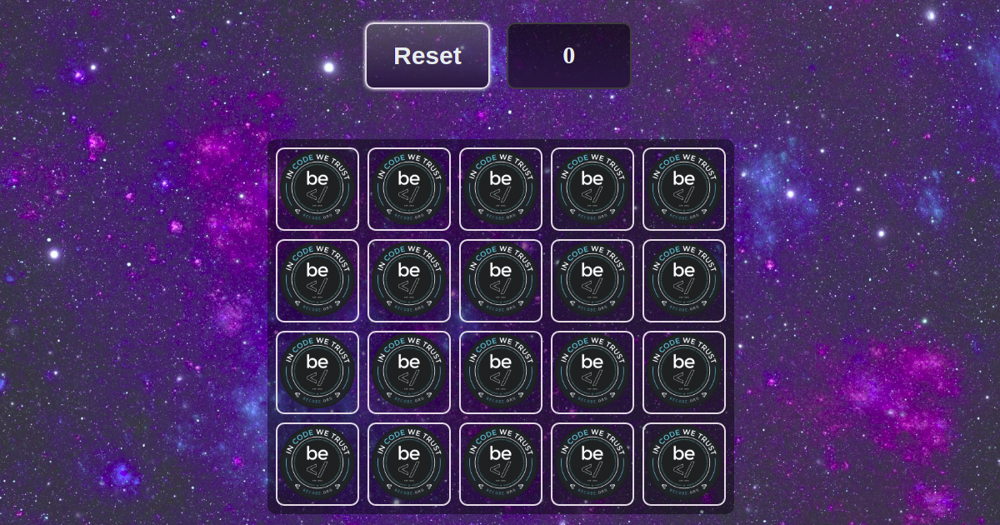
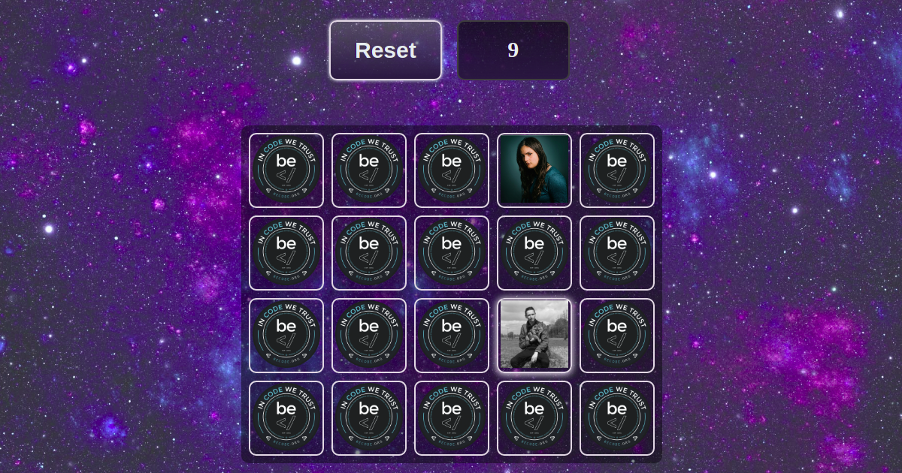

# Memory game - Pexeso

## A game project created by me - a student of BeCode.org.

>[Michaela Harinova](https://github.com/mharin)

## This is a learning challenge type project.     
#### I tried to mainly focus on JavaScript, to test and improve my skills that I gained so far.
#### The deployment strategy is Github page.

> The assigment was to recreate the card game known as "Pairs", "Memory", "Pexeso" or "Concentration Memory Game".    
> It is a game where  you have a bunch of cards made up of pairs of the same image - in my case it is 20 cards = 10 pairs.  
> As I mentioned, cards contains an image - I used profile pictures of my classmates .  
> The cards are placed in a random order.   
> You get to turn them around and look for a match to get a pair of the same cards.     
> Each turn you may flip just two random cards. 
> If they do not match they will turn back - face down.     
> If they do match they stay face up, so you can see the pair of images.

### Start/Restart play field
This is how start play field looks.     
You can restart your game anytime you need thanks to the restart button.              

### Turned cards
Next to the restart button is counter of "tries".   
That means that you will get +1 point for each flip of two cards (it does not matter if it is match or not).   
Like that you can follow your improvement. Less tries = better memory.      

### Sources and languages used in this project:
javaScript  
CSS     
HTML    
Background vector created by pikisuperstar - www.freepik.com

